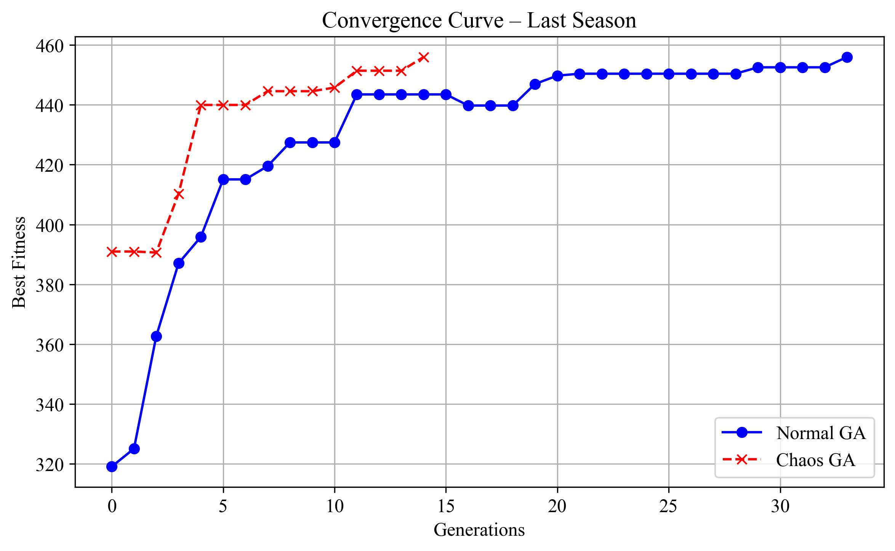
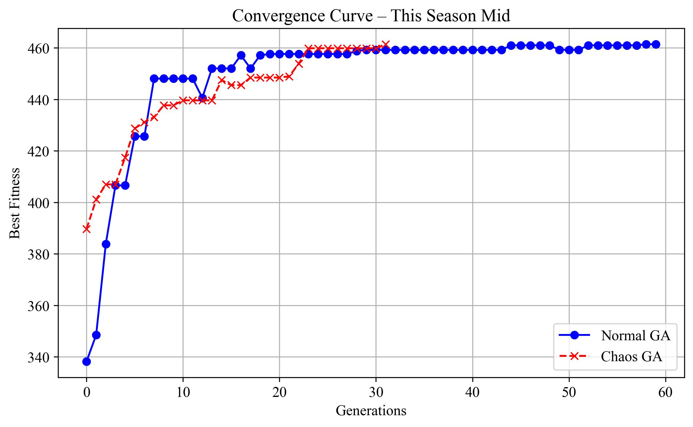
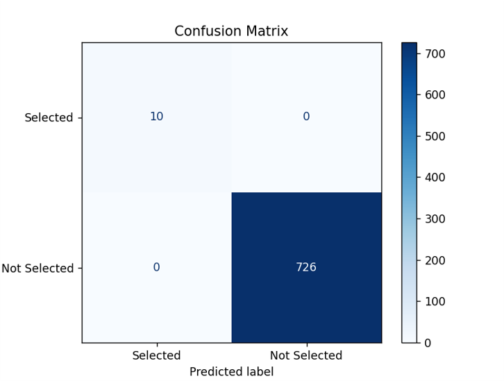
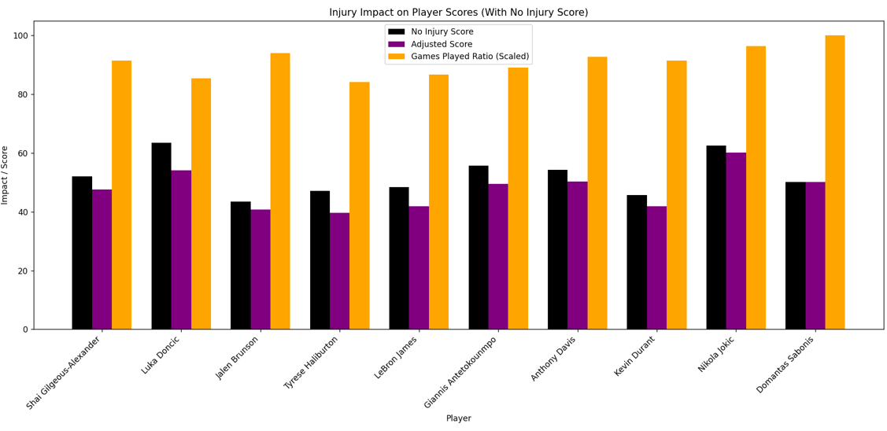
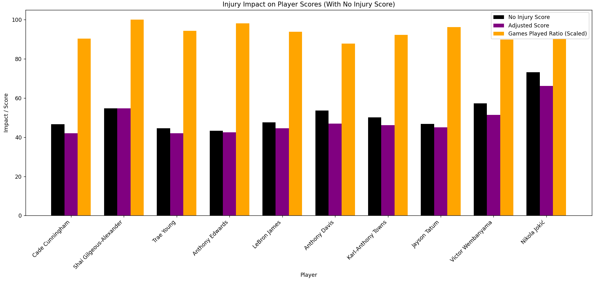
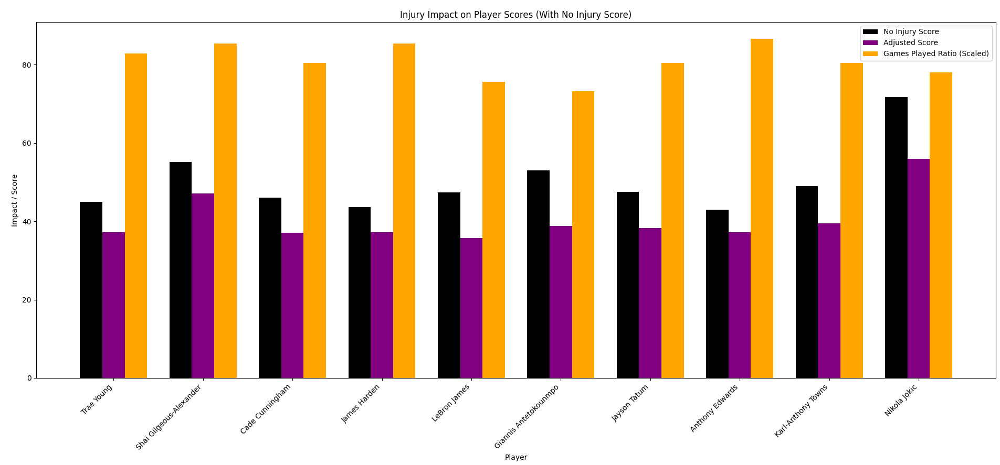

# Fantasy NBA Team Optimization with Hybrid Genetic Algorithm

This project implements a Hybrid Genetic Algorithm (HGA) to optimize Fantasy NBA team selection across different stages of the season (last season, mid-season, end-season).

## Features
- ✅ Hybrid GA + Local Search
- 🔁 Chaos-based Initialization
- ⚠️ Penalty mechanism for injury risk
- 📊 Multi-period validation (previous season, mid, end)
- 📁 Folder structure:
  - `src/`: All GA/HGA Python scripts
  - `data/`: Input NBA stats CSV files
  - `img/`: Result plots and convergence curves


## Results and Convergence

### 📈 Convergence Curve



### 🏀 Injury-Adjusted Player Scores




## How to Run
1. Put your dataset files into `data/`
2. Run the desired script from `src/`, e.g.:
```bash
python src/hga_last_season.py

